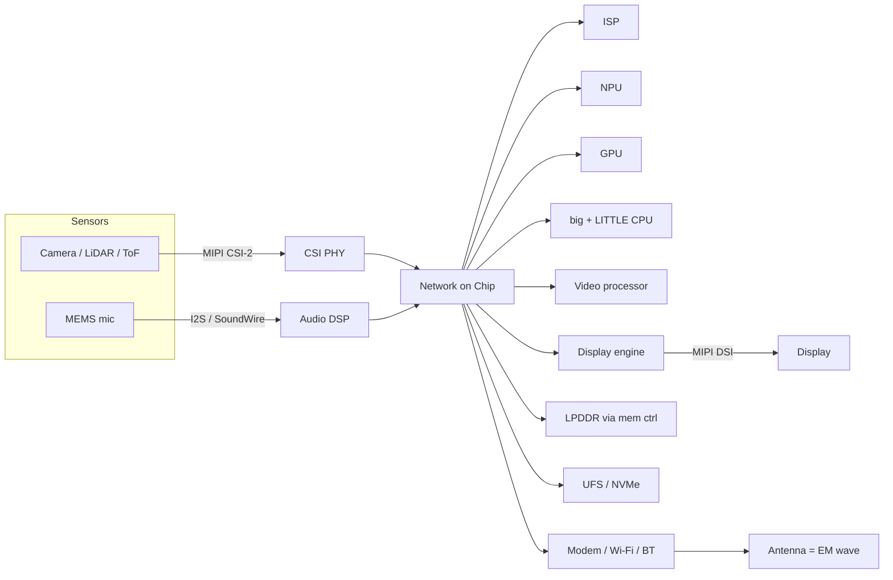
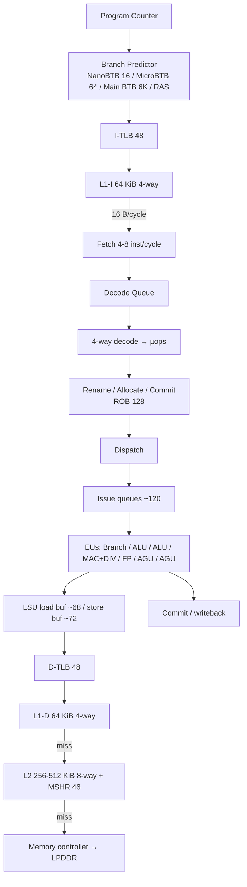
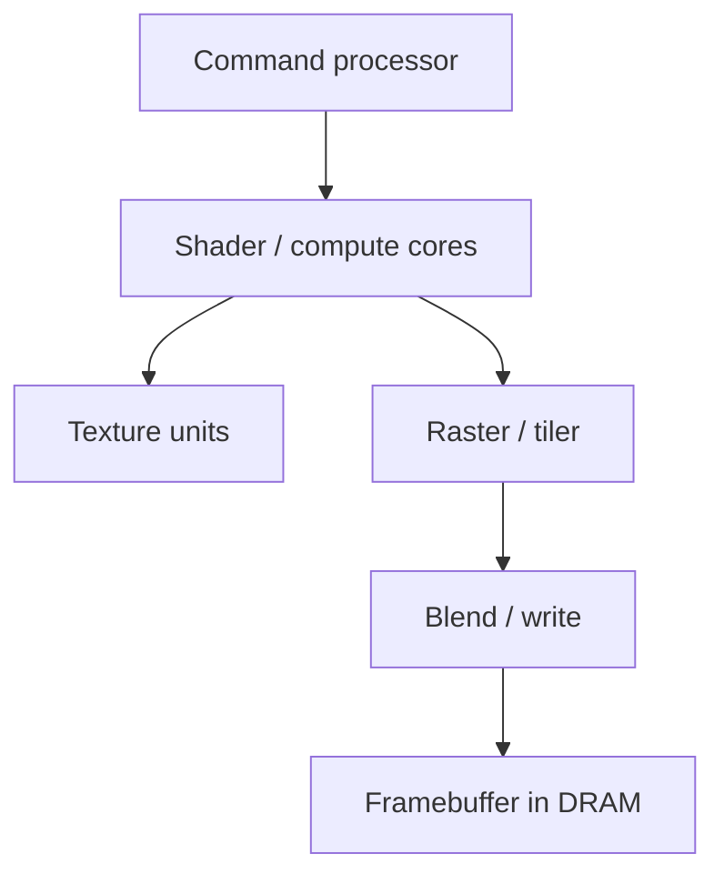
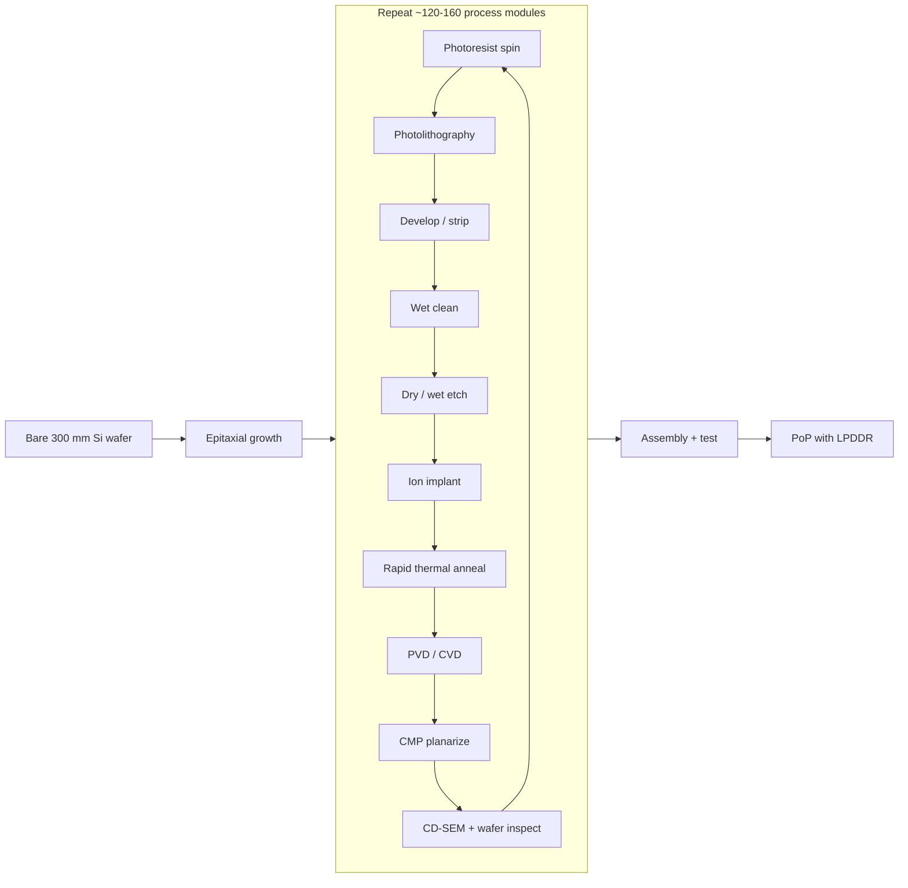
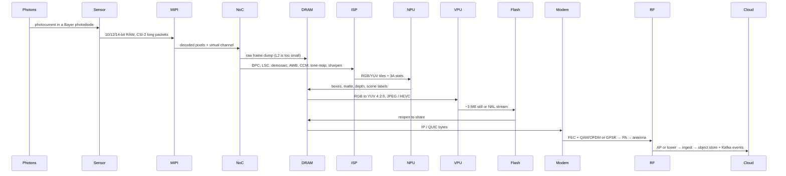

# SoC → Perception → Packet

**Interview-ready map of smartphone silicon for a computer-vision software + hardware engineer.**

This repo turns the Branch Education SoC episode — plus the companion CPU, GPU, manufacturing, camera, memory, and Bluetooth videos — into diagrams you can revise the night before an interview.

> Primary source video: [How do Smartphone CPUs Work? Inside the System on a Chip](https://www.youtube.com/watch?v=NKfW8ijmRQ4) (Branch Education, 24:56).

[](https://www.youtube.com/watch?v=NKfW8ijmRQ4)

---

## Why this exists

A three-year CV engineer is expected to talk across the stack:

1. Photons hit a sensor.
2. An ISP, NPU, GPU, and CPU share one die over a Network-on-Chip.
3. A compressed frame leaves the phone as an electromagnetic wave.
4. A cloud pipeline (object store + Kafka-class log) turns that frame into a product.

If you only know PyTorch, you fail the hardware loop. If you only know RTL, you fail the product loop. This README is the joint language.

---

## Contents

- [Mental model](#mental-model)
- [What "MIBi" on the slide actually is](#what-mibi-on-the-slide-actually-is)
- [SoC floorplan](#soc-floorplan)
- [Design principles](#design-principles)
- [Chip case studies](#chip-case-studies)
- [Processors, interfaces, paths, memory](#taxonomy-for-hardware-engineers)
- [CPU microarchitecture](#cpu-microarchitecture)
- [GPU vs CPU vs NPU vs ISP vs DSP](#gpu-vs-cpu-vs-npu-vs-isp-vs-dsp)
- [Manufacturing](#manufacturing)
- [Case study: photon → EM wave → Kafka](#case-study-photon--em-wave--kafka)
- [Branch Education catalog](#branch-education-catalog)
- [Interview bank](#interview-bank)
- [Further reading](#further-reading)

Deeper notes live in [`docs/`](docs/).

---

## Mental model

A phone is not "a CPU with extras." It is a **city of specialized neighborhoods** connected by digital highways.

```
                    ┌────────────────────────────────────────┐
   CAMERA / LiDAR  │  MIPI CSI-2   several Gbps of Bayer / depth   │
                    └────────────────────────────────────────┘
                                          │
                                          v
   ┌───────────────── SYSTEM ON A CHIP (5–10B transistors) ────────────────┐
   │   ISP   NPU   GPU   big CPU   LITTLE CPU   DSP   VPU   Display   │
   │                         Network on Chip (NoC)                    │
   │   Memory ctrl    Storage ctrl    Modem / Wi-Fi / BT    SEP       │
   └───────────────────────────────────────────────────────────────┘
            │ PoP LPDDR                 │ UFS / NVMe              │ antenna
            v                           v                         v
         working set                 JPEG / HEVC            EM wave @ 2.4/5/6 GHz
```

Apps run on the **general-purpose CPU**. Watching a video, snapping a photo, or running a detector uses **accelerator blocks**. That sentence is the whole design principle of a modern SoC.

---

## What "MIBi" on the slide actually is

The CPU slide in the episode labels two things people mix up.

### 1. MSHR — Miss Status Holding Register

The box next to L2 is **`MSHR (46-entry)`**, not "MIBi."

An MSHR is how a cache stays **non-blocking** (Kroft, 1981, "lockup-free cache"):

```
load X          L1 miss?
                   │
         ┌──────────────────────────────┐
         │ already an MSHR for that line? │
         └──────────────────────────────┘
              │ yes                         │ no
              v                             v
     attach as secondary miss        allocate new MSHR
     (no extra DRAM request)         send fill to L2 / DRAM
                                          │
                              if MSHR file is full → structural stall
```

Each entry tracks the missing line address plus every load/store waiting on it. When data returns, every waiter is satisfied. 46 entries on the teaching slide is a lot — that core can have dozens of outstanding misses and still retire other work.

Contrast three "in-flight" structures:

| Structure | Tracks | Failure mode |
| --- | --- | --- |
| **ROB** | instructions in program order | ROB full → stop allocate |
| **Store buffer** | stores not yet visible | buffer full → stall stores |
| **MSHR** | cache lines on their way back | file full → stall new misses |

### 2. KiB / MiB — binary prefixes

The same slides write `64 KiB` and `256-512 KiB`. That is **IEC 80000-13**:

| Symbol | Name | Bytes |
| --- | --- | --- |
| KiB | kibibyte | 1,024 = 2¹⁰ |
| MiB | mebibyte | 1,048,576 = 2²⁰ |
| GiB | gibibyte | 1,073,741,824 = 2³⁰ |

`64 KiB` L1 = **65,536 bytes**. RAM and caches are addressed in powers of two, so ARM manuals use KiB/MiB. Disk vendors use KB/MB (powers of 1,000). Say the binary names in an interview.

### 3. MIPI — also on the floorplan

The small `MIPI` tags on the die edge are the **Mobile Industry Processor Interface**:

- **CSI-2** — camera / LiDAR / ToF in
- **DSI** — display out
- PHYs: D-PHY (diff pairs + clock), C-PHY (3-wire trios), A-PHY (long-reach automotive)

---

## SoC floorplan

Teaching floorplan reconstructed from the episode (not a vendor die photo).

```
┌─────────────┬────────────┬─────────────┬─────────────────┐
│ NPU        │ big CPU   │ Mem Cache  │ Memory Controller │
│            │           │            │                   │
│ Modem      │   NoC     │            │                   │
│            │ LITTLE CPU│            │        GPU        │
│ DSP        │           │            │                   │
│            │ Display   │ Storage    │ Always-on MCU     │
│ Video Proc │ Engine    │ Controller │ Security Enclave  │
│            │   ISP     │            │ Power Mgmt eFuse  │
└─────────────┴────────────┴─────────────┴─────────────────┘
 MIPI CSI in ───────────────────────────────────────────────────────────►
```



---

## Design principles

From the episode slide:

**I. Hardware accelerators.**  
Identical math on a stream of pixels (convolve, demosaic, DCT, GEMM) is cheaper in a fixed-function block than on a general-purpose core.

**II. Heterogeneous efficiency.**  
big.LITTLE + DVFS + NoC frequency scaling. Park the fat cores. Keep the always-on MCU alive for sensors. The goal is not peak FLOPS. The goal is **frames per joule**.

Together they produce the word on the slide: **Faster** — and cooler, which is what actually ships.

---

## Chip case studies

Full tables: [`docs/chips.md`](docs/chips.md).

| | Snapdragon 808 | Snapdragon 865 | Apple A12 |
| --- | --- | --- | --- |
| Phone in the video | LG V10 (2015) | Galaxy S20 (2020) | iPhone XS (2018) |
| Node | 20 nm | TSMC 7 nm N7P | TSMC 7 nm (first high-volume consumer) |
| Transistors | multi-billion | 10.3 B | 6.9 B |
| CPU | 2× A57 + 4× A53 | Kryo 585 (1+3 A77 + 4 A55) | 2× Vortex 7-wide + 4× Tempest |
| GPU | **Adreno 418** | Adreno 650 | 4-core Apple GPU |
| Vision / AI | dual 12-bit ISP, Hexagon DSP | Spectra 480 @ 2 GP/s, Hexagon 698 15 TOPS | Petra ISP + Depth Engine + 8-core NE 5 TOPS |
| Memory | LPDDR3 ~15 GB/s | LPDDR5 ~44 GB/s | LPDDR4X PoP ~34 GB/s |
| Radio | integrated X10 LTE Cat 9 | discrete X55 5G | LTE (separate) |

Datasheet beats the teaching slide: 808 ships **Adreno 418**, not 430. 430 is the 810.

---

## Taxonomy for hardware engineers

### Processors

| Block | Job in a CV product |
| --- | --- |
| big CPU | app, policy, 3A control, Kafka producer |
| LITTLE CPU | always-on, interrupts, cheap threads |
| GPU | preview, warp/undistort, compose, some inference |
| NPU / Neural Engine / Hexagon tensor | detectors, depth, denoise-AI |
| ISP / CV-ISP | RAW → usable RGB/YUV, 3A stats |
| DSP | mic AEC/NS, IMU fusion, sensor hub |
| Video processor | JPEG / H.264 / HEVC |
| Display engine | layers → panel |
| Always-on MCU | wake, low-power sensing |
| Secure Enclave / SEP | keys, FaceID math, DRM |

### Interfaces

| Interface | Carries |
| --- | --- |
| MIPI CSI-2 | sensor pixels / depth |
| MIPI DSI | display pixels |
| AXI / ACE / CHI | on-die coherent + non-coherent transactions |
| I2C / I3C | sensor control |
| I2S / SLIMbus / SoundWire | audio PCM |
| UFS / NVMe | durable files |
| PCIe (on bigger SoCs) | discrete 5G modem, extra ISP |

### Three paths (say this in interviews)

- **Data path** — the payload. Bayer tiles, activations, encoded NALs.
- **Address path** — VA → TLB / STLB → page walk → PA → cache tags / DRAM row.
- **Control path** — opcodes, ready/valid, ROB commit, NoC credits, 3A FSMs, interrupts, power gates.

A pixel ride uses all three. The AGU builds an address (address path), the LSU moves bytes (data path), the scoreboard decides the load may issue (control path).

### RAMs, memories, registers

```
registers  →  L1 I/D (tens of KiB, 3-4 cycle)  →  L2 (hundreds of KiB)
        →  L3 / system cache (MiB)  →  LPDDR (GiB, ~100 ns)
        →  UFS / NVMe (tens-hundreds of GiB, microseconds)
```

A 12 MP RAW12 frame is ~18–24 MB. L2 is 0.25–8 MiB. **The frame never lives in cache as a whole.** ISP and video blocks DMA tiles through DRAM. That is why bandwidth, not TOPS, is the first number to check.

---

## CPU microarchitecture

Teaching model from the episode (ARM-class out-of-order core; numbers are the slide, not a 1:1 Cortex-A57).



LOAD / STORE / JUMP on the slide are just the three instruction classes the frontend is feeding the backend. Everything else is machinery to keep those three from stalling.

Real A57 reference (for when someone asks "is the slide exact?"): 3-wide decode, 48 KiB L1-I / 32 KiB L1-D, 8 issue pipes. The slide is a composite for teaching.

More: [`docs/cpu-microarch.md`](docs/cpu-microarch.md).

---

## GPU vs CPU vs NPU vs ISP vs DSP

[](https://www.youtube.com/watch?v=h9Z4oGN89MU)
[](https://www.youtube.com/watch?v=16zrEPOsIcI)

| | CPU | GPU | NPU | ISP | DSP |
| --- | --- | --- | --- | --- | --- |
| Shape | few fat cores | thousands of thin ALUs | MAC array | pixel pipeline | VLIW + SIMD |
| Good at | control, OS, irregular code | data-parallel shaders / GEMM | dense INT8/FP16 nets | CFA, 3A, denoise | radio + audio + sensors |
| Latency style | hide one thread's latency with caches + predictors | hide latency by switching warps | stream tiles | fixed latency per stage | hard real-time |
| CV use | orchestration | undistort, preview, some infer | detect / segment / depth | make a sane image | IMU + mic |



Mobile GPUs are usually **tile-based**. They render a bin of the screen at a time so they do not thrash DRAM. That is why a preview pipeline wants the GPU to composite, not to be your ISP.

---

## Manufacturing

[](https://www.youtube.com/watch?v=dX9CGRZwD-w)
[](https://www.youtube.com/watch?v=B2482h_TNwg)



FEOL builds transistors. MOL lands contacts. BEOL stacks metal + vias (the "18 layers of wiring" in the zoom-into-a-CPU short). A12 and 865 are 7 nm FinFET. 808 is 20 nm planar. Same loop, tighter pitch.

More: [`docs/manufacturing.md`](docs/manufacturing.md).

---

## Case study: photon → EM wave → Kafka

This is the story to tell on a whiteboard.



### Numbers you should be able to derive

- 12 MP × 12-bit RAW ≈ 18 MB/frame. At 30 fps that is ~540 MB/s **in**, before ISP writeback and GPU preview.
- 865 LPDDR5 is ~44 GB/s **shared** with CPU, GPU, NPU, display. Vision is a bandwidth tax, not a free lunch.
- Glass-to-glass preview is often 50–80 ms. Budget: sensor rolling shutter + CSI + ISP + GPU compose + DSI. Detection on NPU is extra.

### Other sensors

```
LiDAR / iToF / dToF  — MIPI CSI-2 depth or raw histograms → depth engine / NPU → fuse with RGB
Microphone           — MEMS → amp → ADC → I2S → Hexagon / audio DSP → PCM or Opus → same radio
IMU                  — SPI/I2C → sensor hub / LITTLE CPU → timestamp onto the same frame bag
```

### Bits become a field

```
JPEG bytes in DRAM
  → socket (TCP or QUIC) or BT L2CAP
  → MAC (802.11 / LTE PDCP-RLC-MAC / BT)
  → PHY: scramble, FEC, interleave, constellation
       Wi-Fi / LTE / 5G: OFDM + QAM, IFFT, cyclic prefix
       Bluetooth Classic: GFSK + FHSS across 79 channels at 2.4 GHz
  → DAC → mixer × local oscillator → PA → antenna
  → propagating EM wave (E and B, c = 1/√(μ₀ε₀))
```

Receive is the inverse: LNA → mixer → ADC → demod → FEC → MAC → IP → app.

### Where Kafka actually sits

The phone never speaks Kafka to the NoC. The phone is a **producer**.

```
device MediaCodec (video HW)
  → ingest API over Wi-Fi / 5G
  → object store for media  +  Kafka / Pulsar / Kinesis for events
  → Flink / consumer group  → model serving  → annotations
  → HLS / DASH / WebRTC for humans
```

Use Kafka for metadata, embeddings, timestamps, farm-status. Use Kinesis Video, WebRTC, SRT, or HLS for the media itself. A Kafka partition is a useful analogy for a NoC virtual channel. It is not a video PHY.

More: [`docs/sensor-to-cloud.md`](docs/sensor-to-cloud.md).

---

## Branch Education catalog

Watch these in this order if you are cramming silicon + perception.

| Topic | Video |
| --- | --- |
| SoC floorplan + photo path | [NKfW8ijmRQ4](https://www.youtube.com/watch?v=NKfW8ijmRQ4) |
| CPU from transistors to OoO | [16zrEPOsIcI](https://www.youtube.com/watch?v=16zrEPOsIcI) |
| GPU architecture | [h9Z4oGN89MU](https://www.youtube.com/watch?v=h9Z4oGN89MU) |
| Transistors → standard cells | [_Pqfjer8-O4](https://www.youtube.com/watch?v=_Pqfjer8-O4) |
| Manufacturing loop | [dX9CGRZwD-w](https://www.youtube.com/watch?v=dX9CGRZwD-w) |
| EUV scanner | [B2482h_TNwg](https://www.youtube.com/watch?v=B2482h_TNwg) |
| DRAM | [7J7X7aZvMXQ](https://www.youtube.com/watch?v=7J7X7aZvMXQ) |
| Cache + storage | [TfhL5kBiQVI](https://www.youtube.com/watch?v=TfhL5kBiQVI) |
| NAND / SSD | [5Mh3o886qpg](https://www.youtube.com/watch?v=5Mh3o886qpg) |
| Bluetooth PHY | [1I1vxu5qIUM](https://www.youtube.com/watch?v=1I1vxu5qIUM) |
| Camera | [B7Dopv6kzJA](https://www.youtube.com/watch?v=B7Dopv6kzJA) |
| What's inside a phone | [fCS8jGc3log](https://www.youtube.com/watch?v=fCS8jGc3log) |
| Ray tracing | [iOlehM5kNSk](https://www.youtube.com/watch?v=iOlehM5kNSk) |

Channel: [Branch Education](https://www.youtube.com/@brancheducation) · site: [branch.education](https://branch.education/)

---

## Interview bank

Full list with prompts: [`docs/interview-qa.md`](docs/interview-qa.md).

Start here:

1. Walk one pixel from photodiode to JPEG. Name every block.
2. Why a 12 MP RAW frame cannot sit in L2. What does that force in the ISP?
3. MSHR vs ROB vs store buffer.
4. `64 KiB` and `4 MiB` in bytes. Why ARM uses KiB.
5. Why ISP before NPU — and when you would train on RAW.
6. How NoC QoS keeps camera DMA from starving the CPU.
7. Discrete X55 on 865 vs integrated X10 on 808.
8. Bits in DRAM → 5 GHz Wi-Fi carrier.
9. Why Kafka is a bad raw-video pipe and a good event pipe.
10. Pointer authentication on A12 in one sentence.

---

## Further reading

- Qualcomm Snapdragon 808 and 865 product briefs
- [WikiChip: Snapdragon 865](https://en.wikichip.org/wiki/qualcomm/snapdragon_800/865)
- [Wikipedia: Apple A12](https://en.wikipedia.org/wiki/Apple_A12)
- ARM Cortex-A57 Technical Reference Manual
- IEC 80000-13 (KiB / MiB)
- Kroft, "Lockup-free instruction fetch/prefetch cache organization," ISCA 1981

Screenshots that started this repo stay with Branch Education. Recreated ideas only. See [`NOTICE.md`](NOTICE.md).
